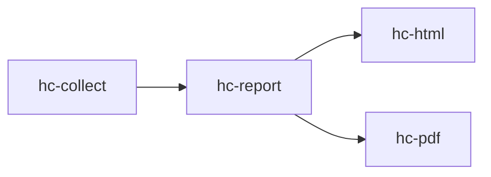
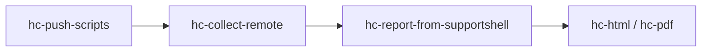

# Red Hat health checks

An OpenShift cluster or a must-gather goes in. A scored report, HTML, and PDF come out.

## Pick a path

| | Live cluster | Must-gather |
|---|---|---|
| You have | An OpenShift cluster | A must-gather on a support shell |
| You get | A scored report, HTML, and PDF | A scored report, HTML, and PDF |
| First command | `make setup CLIENT="Example Client" PROJECT="HC"` | `make setup CLIENT="Example Client" PROJECT="HC"` |
| Then | [Live cluster](#live-cluster) | [Must-gather](#must-gather) |

## Before you run

| You are running | You need |
|---|---|
| `hc-collect` | `oc` on the host, and `python3` for categories `10` and `11` |
| `setup`, `hc-report`, `hc-html`, `hc-pdf` | `make`, plus Podman or Docker |
| `hc-push-scripts`, `hc-collect-remote`, `hc-fetch-results` | `ssh` and `rsync` on the host |
| `HC_SUMMARY_CONCLUSION=1` or `hc-summary-conclusion` | `CURSOR_API_KEY` or `~/.config/arch-doc-gen/cursor_api_key` |
| `make test` | `python3` and `pytest` |

Podman is used when it is on `PATH`. Set `ENGINE=docker` to force Docker. The pipeline image is `redhat-health-checks`. It builds the first time a container target runs.

> **Client data stays on the machine.** `project.yaml`, `output/`, and kubeconfigs are gitignored. Copy templates; do not commit the filled copies.

## Live cluster

| | Command | You get |
|---|---|---|
| 1 | `make setup CLIENT="Example Client" PROJECT="HC"` | `project.yaml`, plus `output/hc_collect` and `output/Health_Check_Report` |
| 2 | `make hc-collect KUBECONFIG=<path>` | Cluster JSON on the host |
| 3 | `make hc-report` | Markdown report and audit JSON |
| 4 | `make hc-html` / `make hc-pdf` | Collapsible HTML and a branded PDF |

Setup leaves existing files alone. Pass `FORCE=1` when you mean to replace them. Place TSR HTML under `output/tsr_html/` before `hc-report` when catalog rows should be scored. Without matching HTML, those rows are SKIPPED.

`make status` shows how far this engagement has gotten. `make help` lists every target. Every Health Check target: [scripts/health_check/README.md](scripts/health_check/README.md).

## Must-gather

| | Command | You get |
|---|---|---|
| 1 | `make setup CLIENT="Example Client" PROJECT="HC"` | `project.yaml`, plus `output/hc_collect` and `output/Health_Check_Report` |
| 2 | `make hc-push-scripts HC_SSH_HOST=user@host` | Collection scripts on the support shell |
| 3 | `make hc-collect-remote HC_SSH_HOST=user@host HC_MG_INPUT=<path>` | Results collected against the must-gather |
| 4 | `make hc-report-from-supportshell HC_SSH_HOST=user@host` | Fetched results, then the report |
| 5 | `make hc-html` / `make hc-pdf` | Collapsible HTML and a branded PDF |

`yank` is interactive. Run it on the support shell after step 2, then pass the extracted path as `HC_MG_INPUT`. `make hc-fetch-results` stages a tarball you already collected. Operator steps: [scripts/health_check/supportshell/README.md](scripts/health_check/supportshell/README.md).

## Where to read next

| Question | Doc |
|---|---|
| How do I collect from a live cluster? | [Collection scripts](scripts/health_check/collect/README.md) |
| How do I collect from a must-gather? | [Supportshell scripts](scripts/health_check/supportshell/README.md) |
| What does each target do? | [Health Check scripts](scripts/health_check/README.md) |
| Why did a check score that way? | [Check rationale](docs/HC_CHECK_RATIONALE.md) |
| What does the engine score? | [Native scoring audit](docs/hc_rules_audit/README.md) |
| What commands does collect run? | [Command reference](docs/HC_Command_Reference.md) |
| What can I pass to `make`? | [Environment variables](scripts/health_check/collect/README.md#environment-variables) |

## License

GNU GPLv3. See [LICENSE](LICENSE).
